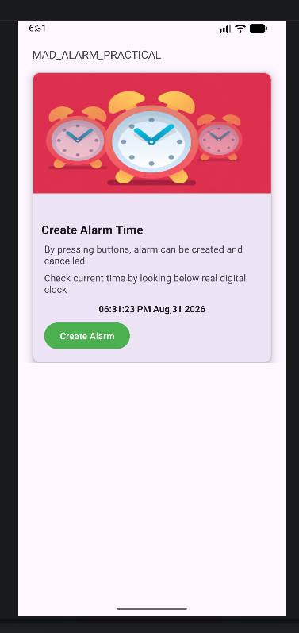
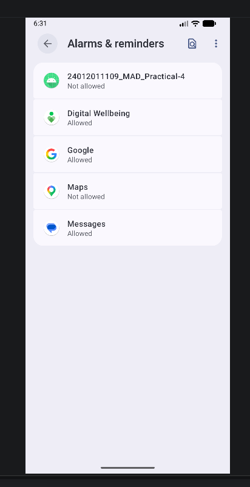
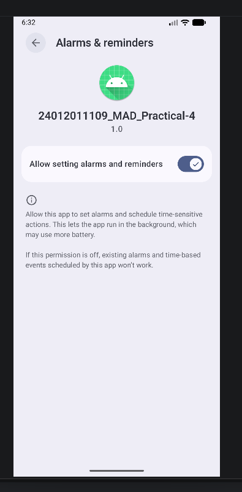
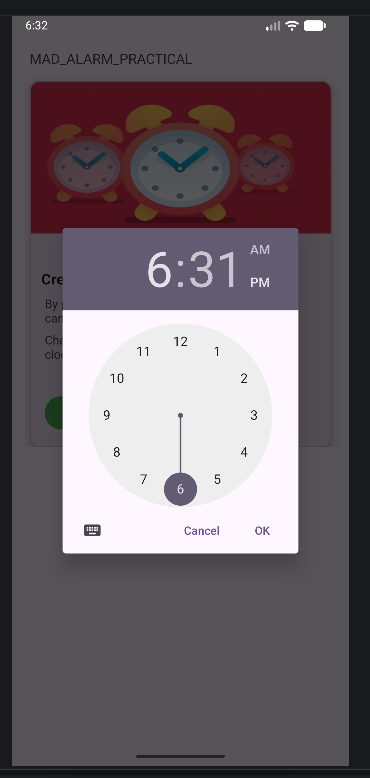
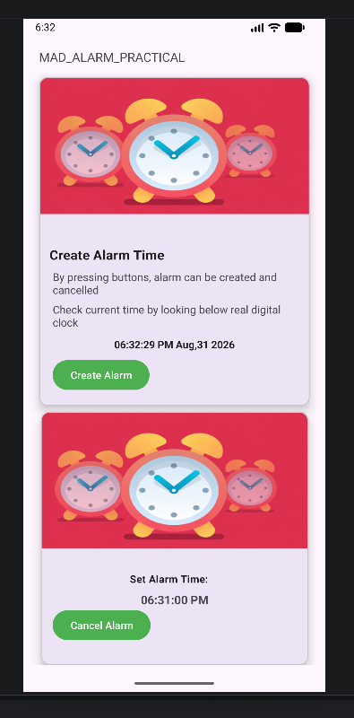

# Practical-4: Android Alarm Application

## Aim

Create an Android Alarm application using **Service** and **BroadcastReceiver**.

## Description

This practical demonstrates how to create an Android Alarm Application using
**Service, BroadcastReceiver, and AlarmManager**.

The application allows the user to select a specific time, create an alarm,
and cancel the alarm when required. It also demonstrates the permission
required for setting alarms and reminders on Android.

## Features

- Display the current digital time.
- Create an alarm using TimePicker.
- Schedule an exact alarm using AlarmManager.
- Handle the alarm using BroadcastReceiver.
- Use Service for alarm-related operations.
- Request permission for setting alarms and reminders.
- Display the created alarm time.
- Cancel the created alarm.

## Technologies Used

- **Language:** Kotlin
- **IDE:** Android Studio
- **Platform:** Android
- **UI:** XML

## Android Components Used

- Activity
- Service
- BroadcastReceiver
- AlarmManager
- TimePicker
- Intent

## Application Flow

1. Open the application.
2. The current digital time is displayed.
3. Press **Create Alarm**.
4. Select the required time using the TimePicker.
5. Allow the required alarm permission if prompted.
6. The selected alarm time is displayed.
7. The alarm can be cancelled using **Cancel Alarm**.

## Output

### 1. Home Screen

The main screen displays the current digital time and provides an option
to create an alarm.

### 2. Alarm Permission List

The application appears in the Android **Alarms & reminders** permission list.

### 3. Alarm Permission

The user can allow the application to set alarms and reminders.

### 4. Time Picker

The user can select the required alarm time using the Android Time Picker.

### 5. Alarm Created

After selecting the time, the alarm is created and the selected alarm time
is displayed. The user can also cancel the alarm.

## Conclusion

Thus, an Android Alarm Application was successfully created using
**Service, BroadcastReceiver, and AlarmManager** in Kotlin.
